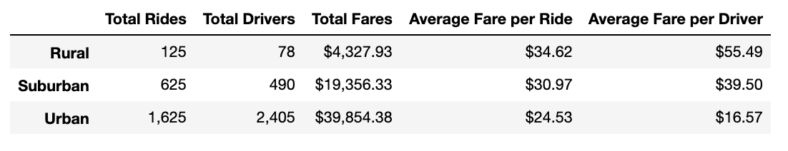

# PyBer Analysis

## Overview
We are looking for differences in fares by city types which are categorized as Urban, Suburban, and Rural form our ride sharing data. From our findings we will create a line chart using Pandas and Matplotlib that displays these trends and highlights differences.

## Analysis
show differences in ride sharing data between cities

## Summary
provide three business recommendations to the CEO for addressing any disparities among the city types.
